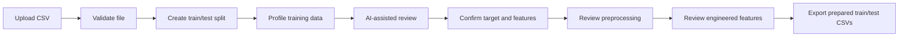
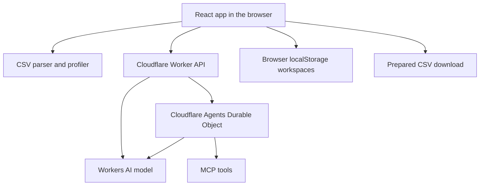

# Automated Feature Engineering — AI-assisted dataset preparation and automated feature engineering

`automated-fe` is a Cloudflare Workers AI application for exploring how AI can help with the early stages of a machine learning workflow: understanding a CSV dataset, selecting the target and usable feature columns, suggesting safe preprocessing steps, and preparing the data for modeling.

The current version focuses on **CSV profiling, AI-assisted review, deterministic train/test splitting, preprocessing, and export**. The long-term objective is to extend this foundation into a controlled **automated feature engineering system** that can generate new predictive features from existing columns.

---

## Demo

```md

```

---

## Why this project?

Feature engineering is often one of the most manual and repetitive parts of building a machine learning model.

A data scientist usually needs to:

- inspect the dataset,
- identify the prediction target,
- decide which columns are usable,
- clean inconsistent values,
- handle missing data,
- encode categorical variables,
- avoid target leakage,
- and test many possible feature transformations.

This project explores how Cloudflare Workers AI can support that process by combining:

- deterministic local profiling,
- safe preprocessing rules,
- AI-assisted dataset review,
- human-in-the-loop decisions,
- and a future automated feature generation layer.

The goal is **not** to let an LLM freely mutate the dataset. Instead, the project uses AI to guide a controlled, explainable, and auditable feature preparation workflow.

---

## Current workflow



## Product workflow

1. **Start a workspace.** Workspaces are stored in the browser so separate dataset experiments can be kept apart.
2. **Choose a dataset.** Upload a CSV file or load one of the bundled sample datasets from `public/datasets/`.
3. **Configure the split.** Choose a train/test split ratio and seed. The app profiles the training rows only, which keeps test rows held out from review and preprocessing decisions.
4. **Profile the CSV.** The browser parses the CSV, infers column types, samples values, counts missingness, detects likely identifiers, flags constant or empty columns, and builds a compact profile.
5. **Generate an AI column review.** The Worker calls Workers AI to suggest a target column and keep/drop/review decisions for each column.
6. **Confirm the target and features.** The user remains in control of the target, selected feature columns, and dropped columns.
7. **Generate preprocessing suggestions.** Workers AI proposes preprocessing actions for the kept columns, while the UI lets the user accept or reject each action.
8. **Generate feature suggestions.** The app asks for candidate engineered features, validates them against a strict expression grammar, and rejects suggestions that reference unknown columns, blocked columns, or the target.
9. **Export prepared data.** The browser materializes accepted preprocessing and engineered features, then downloads prepared train and test CSV files.

## Features

- CSV upload with size and file-type validation.
- Bundled sample datasets for quick demos.
- Deterministic train/test splitting with configurable ratio and seed.
- Training-only profiling to reduce leakage into the test set.
- Column summaries with inferred type, missing counts, unique counts, top values, sample values, and quality notes.
- Column filtering and sorting for fast dataset inspection.
- AI-assisted target suggestion and column keep/drop/review decisions.
- Human-in-the-loop target, feature, preprocessing, and engineered-feature approval.
- Preprocessing support for actions such as trimming whitespace, standardizing missing-like tokens, normalizing booleans, filling missing numeric/categorical values, one-hot encoding, lowercasing, and splitting likely name fields.
- Safe feature engineering grammar for numeric transforms, ratios, differences, products, and date parts.
- Validation that blocks feature suggestions using the target column or unknown columns.
- Export of transformed CSV files, including separate train/test downloads when a split is configured.
- Agent chat sidebar with active dataset context, file/image attachments, MCP server management, and scheduled reminder support.
- Browser-local workspace persistence.
- Light and dark theme support.

## Architecture



### Main parts

- `src/app.tsx` contains the React workspace UI, upload flow, split configuration, review panels, chat sidebar, and CSV export behavior.
- `src/csv-profile.ts` contains CSV validation, parsing, profiling, deterministic splitting, preprocessing materialization, and export generation.
- `src/feature-engineering.ts` defines the allowed feature-expression grammar and validates AI-generated feature suggestions before they can be accepted.
- `src/server.ts` is the Cloudflare Worker entry point. It exposes the AI review endpoints and hosts the `ChatAgent` Durable Object used by the agent sidebar.
- `src/client.tsx` mounts the React app.
- `public/datasets/manifest.json` lists bundled demo datasets.
- `wrangler.jsonc` configures the Worker, static assets, Workers AI binding, Durable Object binding, migrations, observability, source maps, and Node.js compatibility.

### Cloudflare services

- **Workers** serve the app and API routes.
- **Workers Static Assets** serve the frontend assets alongside the Worker.
- **Workers AI** powers column review, preprocessing review, chat, and feature suggestions through the `AI` binding.
- **Durable Objects** back the `ChatAgent` state and scheduled tasks.
- **Observability** is enabled in `wrangler.jsonc`.

## Tech stack

- React 19
- Vite
- TypeScript
- Cloudflare Workers
- Cloudflare Vite plugin
- Cloudflare Workers AI
- Cloudflare Agents SDK
- Durable Objects
- Papa Parse
- Vitest
- oxlint and oxfmt

## Local development

Install dependencies:

```sh
npm install
```

Start the Vite development server:

```sh
npm run dev
```

Run the Worker locally with Wrangler when you need the Cloudflare Workers runtime behavior:

```sh
npx wrangler dev
```

Run checks:

```sh
npm run check
```

Generate Cloudflare binding/runtime types after changing bindings in `wrangler.jsonc`:

```sh
npm run types
```

## Deployment

This project is configured for Cloudflare Workers with `wrangler.jsonc`. The deploy script builds the Vite app and then deploys the Worker:

```sh
npm run deploy
```

Equivalent manual commands:

```sh
npm run check
npx vite build
npx wrangler deploy
```

Before deploying:

1. Log in to Cloudflare if needed:

   ```sh
   npx wrangler login
   ```

2. Confirm the Worker name in `wrangler.jsonc`:

   ```jsonc
   "name": "automated-fe"
   ```

3. Confirm the configured Workers AI model:

   ```jsonc
   "vars": {
     "AI_MODEL": "@cf/qwen/qwen3-30b-a3b-fp8"
   }
   ```

4. Confirm these bindings are present:
   - `AI` Workers AI binding
   - `ChatAgent` Durable Object binding
   - Durable Object migration for `ChatAgent`

5. Regenerate types if bindings changed:

   ```sh
   npm run types
   ```

6. Deploy:

   ```sh
   npm run deploy
   ```

Wrangler deploys the Worker and static assets together. The current configuration also routes `/agents/*`, `/api/*`, and `/oauth/*` through the Worker before asset handling so the API and agent endpoints are handled by `src/server.ts`.

## Useful commands

| Command            | Purpose                                           |
| ------------------ | ------------------------------------------------- |
| `npm run dev`      | Start the Vite dev server                         |
| `npx wrangler dev` | Run locally with Wrangler                         |
| `npm run check`    | Run formatting check, lint, TypeScript, and tests |
| `npm run test`     | Run Vitest tests                                  |
| `npm run lint`     | Run oxlint                                        |
| `npm run format`   | Format the project                                |
| `npm run types`    | Generate Cloudflare types into `env.d.ts`         |
| `npm run deploy`   | Build and deploy to Cloudflare Workers            |

## Notes and constraints

- The CSV size limit is currently `10 MB`.
- AI suggestions are advisory. The user confirms target, feature columns, preprocessing, and engineered features before export.
- Feature engineering is intentionally constrained to a typed expression grammar to reduce leakage and unsafe transformations.
- Workspace state is browser-local, not stored in a shared backend database.
- The test set is held out from profiling when train/test splitting is enabled.

## References

- [Cloudflare Workers docs](https://developers.cloudflare.com/workers/)
- [Workers Static Assets docs](https://developers.cloudflare.com/workers/static-assets/)
- [Wrangler commands](https://developers.cloudflare.com/workers/wrangler/commands/workers/)
